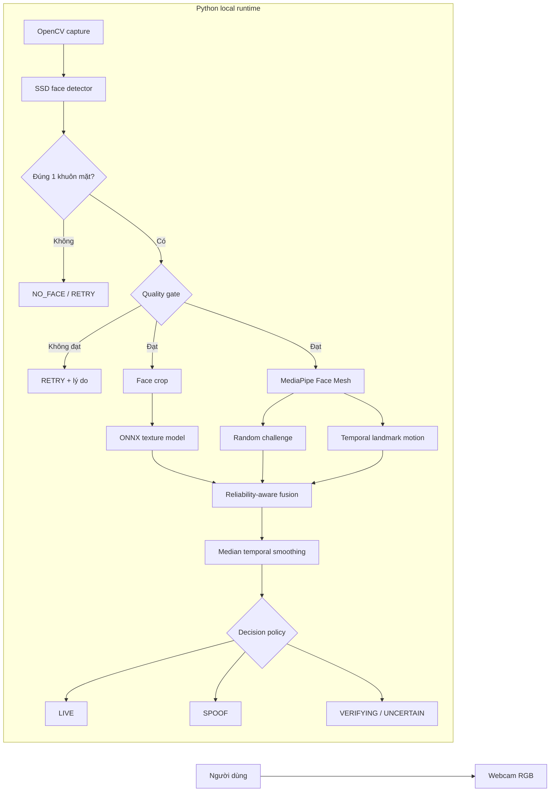
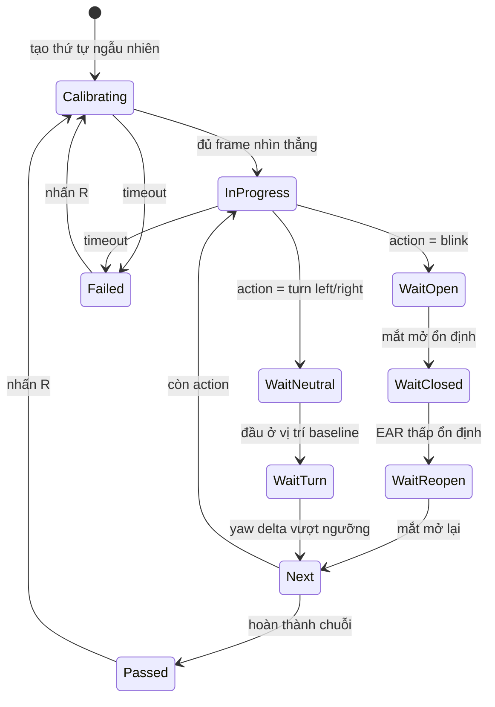
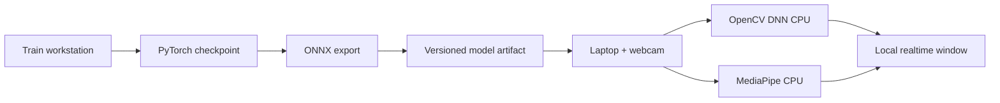

# Kiến trúc RGB Face Anti-Spoofing 2.0

> Tài liệu phản ánh code trong repository ngày 11/09/2026. Các con số chất lượng chỉ được thêm sau khi chạy evaluation với manifest/model hash tương ứng.

Hệ thống là một ứng dụng PAD chạy local, nhận video từ webcam RGB phổ thông và hợp nhất ba tín hiệu phần mềm. Không yêu cầu camera nhiệt, depth, IR hay cảm biến chuyên dụng.

## Sơ đồ tổng quan



## Luồng quyết định realtime

```mermaid
flowchart TD
    Frame["Frame mới"] --> Detect["Detect faces"]
    Detect --> FaceCount{"Số mặt"}
    FaceCount -->|0| NoFace["NO_FACE"]
    FaceCount -->|> 1| Multi["RETRY: multiple_faces"]
    FaceCount -->|1| Q["Brightness + blur + face area"]
    Q --> QPass{"Quality đạt?"}
    QPass -->|Không| QRetry["RETRY, không kết luận spoof"]
    QPass -->|Có| Parallel["Chạy/cập nhật các signal"]
    Parallel --> T["Texture live probability"]
    Parallel --> L["EAR + yaw proxy"]
    Parallel --> M["Procrustes residual"]
    L --> C["Challenge state machine"]
    T --> Hard{"Texture cực thấp?"}
    Hard -->|Có| Early["SPOOF sớm"]
    Hard -->|Không| F["Weighted score × reliability"]
    C --> F
    M --> F
    F --> ChallengeGate{"Challenge đã pass?"}
    ChallengeGate -->|Chưa| Collect["VERIFYING"]
    ChallengeGate -->|Timeout| Retry2["RETRY"]
    ChallengeGate -->|Đã pass| Coverage{"Đủ evidence weight?"}
    Coverage -->|Không| Unknown["UNCERTAIN"]
    Coverage -->|Có| Window["Median score window"]
    Window --> Threshold{"Threshold"]
    Threshold -->|>= live| Live["LIVE"]
    Threshold -->|<= spoof| Spoof["SPOOF"]
    Threshold -->|Ở giữa| Unknown
```

## Luồng landmark và thử thách



EAR (Eye Aspect Ratio - tỷ lệ hình học mắt) lấy từ 12 điểm quanh hai mắt. Hướng quay đầu dùng độ lệch tương đối của mũi so với trung điểm mắt, chuẩn hóa theo bề rộng khuôn mặt và so với baseline của chính phiên hiện tại. Cách này không cần hiệu chuẩn camera nhưng chỉ là yaw proxy, không phải góc 3D tuyệt đối.

## Hợp nhất tín hiệu

Mỗi signal trả:

```text
score       xác suất/điểm live trong [0, 1], hoặc None nếu chưa có
reliability độ tin cậy của observation trong [0, 1]
reason      lý do có thể audit
metadata    latency/giá trị đo phục vụ debug
```

Điểm tức thời:

```text
effective_weight_i = configured_weight_i × reliability_i
live_score = Σ(effective_weight_i × score_i) / Σ(effective_weight_i)
```

Signal thiếu bị bỏ khỏi cả tử và mẫu; nó không được xem là bằng chứng giả. Decision policy vẫn kiểm tra tổng trọng số evidence để tránh một luồng đơn lẻ tự phê duyệt `LIVE`. Median của nhiều frame giảm outlier và hiện tượng nhấp nháy.

Trọng số mặc định:

| Signal | Weight | Ghi chú |
|---|---:|---|
| Texture | 0.55 | Tín hiệu chính, phải được train/evaluate đúng protocol |
| Challenge | 0.30 | Chỉ có score sau khi pass/timeout |
| Motion | 0.15 | Tín hiệu phụ, reliability tăng theo số frame |

Mọi weight/threshold nằm ở `config/default.toml` và phải được tune trên validation, không được nhìn test để sửa.

## Luồng dữ liệu, huấn luyện và đánh giá

```mermaid
flowchart LR
    Consent["Consent + capture plan"] --> Videos["Video có subject/session/attack"]
    Videos --> Extract["Sample FPS + face crop"]
    Extract --> Dedup["Near-duplicate filter"]
    Dedup --> Manifest["manifest.csv"]
    Manifest --> Split["Subject-disjoint split"]
    Split --> Train["Train MobileNetV3-Small"]
    Train --> Select["Early stop trên validation ACER"]
    Select --> ONNX["Export ONNX [spoof, live]"]
    ONNX --> Tune["Tune threshold trên validation"]
    Tune --> Test["Test một lần"]
    Test --> FrameMetrics["Frame metrics"]
    Test --> VideoMetrics["Video metrics chính"]
    VideoMetrics --> Report["Hash manifest + model + report"]
```



## Thành phần và vị trí code

| Thành phần | File chính | Trách nhiệm |
|---|---|---|
| Runtime coordinator | `src/face_antispoofing/pipeline.py` | Điều phối toàn bộ frame |
| Camera CLI | `src/face_antispoofing/cli.py` | Webcam, overlay, reset/quit |
| Face detection | `src/face_antispoofing/detector.py` | OpenCV SSD adapter, clamp/padding box |
| Quality gate | `src/face_antispoofing/quality.py` | Brightness, Laplacian blur, face area |
| Landmarks | `src/face_antispoofing/landmarks.py` | Face Mesh, EAR, yaw proxy, mouth ratio |
| Challenge | `src/face_antispoofing/challenge.py` | Chuỗi action ngẫu nhiên, timeout, state machine |
| Temporal motion | `src/face_antispoofing/motion.py` | Similarity alignment và residual |
| Texture inference | `src/face_antispoofing/texture.py` | OpenCV DNN ONNX, class order `[spoof, live]` |
| Fusion | `src/face_antispoofing/fusion.py` | Weight, reliability, coverage, smoothing, threshold |
| Data contract | `src/face_antispoofing/dataset.py` | Parse layout, subject split, leakage audit |
| Training | `scripts/train_texture.py` | MobileNetV3-Small, augmentation, checkpoint, ONNX |
| Evaluation | `scripts/evaluate_texture.py` | Threshold val, test frame/video, report hash |

## Nguyên tắc kiến trúc

1. Fail closed: không đủ evidence thì không trả `LIVE`.
2. Retry is not spoof: lỗi chất lượng và timeout không được dùng để buộc tội.
3. Tách data plane và runtime plane: webcam không phụ thuộc PyTorch; runtime chỉ cần ONNX qua OpenCV.
4. Split theo người trước khi train: mọi frame/video của một subject nằm trong một split.
5. Video-level first: kết luận cuối và báo cáo chính gom theo source video, không thổi phồng sample count bằng frame gần trùng.
6. Reproducible evaluation: lưu threshold, command, manifest SHA-256 và model SHA-256.
7. Explainable evidence: mọi signal có score, reliability và reason để debug/ablation.

## Failure modes

| Điều kiện | Kết quả | Lý do |
|---|---|---|
| Không có mặt | `NO_FACE` | Không có input để đánh giá |
| Nhiều mặt | `RETRY` | Không biết thử thách thuộc người nào |
| Quá tối/sáng/mờ/xa/gần | `RETRY` | Signal không đáng tin |
| Đang calibrate/thử thách | `VERIFYING` | Chưa đủ temporal evidence |
| Challenge timeout | `RETRY` | Giảm false accusation |
| Thiếu model và không bật chế độ demo | `UNCERTAIN` | Evidence weight dưới mức an toàn |
| Texture cực thấp | `SPOOF` | Reject sớm theo policy cấu hình |
| Score ở vùng xám | `UNCERTAIN` | Không ép quyết định nhị phân |

## Triển khai



Repository chưa có model registry/server. Với đồ án, nên version model bằng tên chứa ngày/commit và lưu report hash cạnh artifact; dữ liệu khuôn mặt không đưa lên Git.

## Giới hạn và hướng mở rộng

- Luồng texture chưa được train vì dataset không có trong workspace.
- Face detector Caffe cũ có thể thay bằng MediaPipe/RetinaFace sau khi benchmark latency; thay detector không được làm thay đổi test set.
- Motion residual là heuristic yếu và cần ablation để chứng minh có ích.
- Active challenge chống ảnh tĩnh tốt hơn nhưng video/deepfake tương tác có thể thích ứng; không tuyên bố chống injection.
- rPPG để ở research backlog vì độ nhạy với ánh sáng, camera auto-exposure, nén và chuyển động.
- 3D mask mạnh cần depth/IR hoặc phương pháp chuyên sâu hơn; nằm ngoài threat model phần cứng phổ thông hiện tại.
