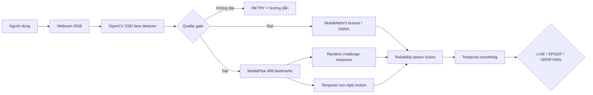

# RGB Face Anti-Spoofing

Hệ thống phát hiện tấn công trình diện khuôn mặt (Presentation Attack Detection - PAD) bằng webcam RGB phổ thông. Bản 2.0 thay mô hình phân loại một ảnh 32×32 bằng pipeline đa tín hiệu: chất lượng ảnh, mô hình texture, landmark 468 điểm, thử thách ngẫu nhiên và chuyển động theo thời gian.

> Trạng thái trung thực: kiến trúc, pipeline dữ liệu, huấn luyện, đánh giá và demo đã có trong code. Dataset khoảng 10.500 ảnh và model cũ không có trong repository hiện tại, vì vậy repository chưa công bố accuracy/ACER thực nghiệm. Policy mặc định không trả `LIVE` khi thiếu model ONNX và chưa đủ bằng chứng.

## Bài toán

- Bản cũ học trực tiếp từ các frame trích ra từ video và chia ảnh ngẫu nhiên. Các frame gần nhau của cùng video có thể xuất hiện ở cả train và test, gây rò rỉ dữ liệu và accuracy cao ảo.
- CNN 32×32 làm mất phần lớn chi tiết da, viền giấy, nhiễu màn hình và moiré cần cho anti-spoofing.
- Phân loại từng frame khiến kết quả nhấp nháy và không tận dụng hành vi sống theo thời gian.
- Chỉ có hai nhãn thư mục `real/fake`, không lưu người, video nguồn, phiên quay, thiết bị hay loại tấn công nên khó đánh giá khả năng tổng quát hóa.
- Một tín hiệu đơn lẻ không đủ mạnh: chớp mắt có thể có trong video replay, còn texture có thể sai khi ánh sáng hoặc camera thay đổi.

## Giải pháp

```text
Webcam RGB
  -> Face detection
  -> Quality gate
  -> Texture model (passive, ONNX)
  -> 468 landmarks + random challenge-response
  -> Non-rigid temporal motion
  -> Reliability-aware score fusion + temporal smoothing
  -> LIVE / SPOOF / VERIFYING / RETRY
```

Các nguyên tắc quan trọng:

1. Chất lượng không đạt thì yêu cầu chụp lại, không kết luận người dùng giả.
2. `LIVE` mặc định cần hoàn thành thử thách ngẫu nhiên và đủ tổng trọng số bằng chứng.
3. Texture rất thấp có thể từ chối sớm; tín hiệu thiếu không được tự động coi là 0 hay 1.
4. Timeout thử thách trả `RETRY`, không gán nhãn `SPOOF` chỉ vì người dùng phản ứng chậm.
5. Threshold được chọn trên validation và chỉ báo cáo một lần trên test tách theo người/video.

## Các luồng đánh giá runtime

| Luồng | Tín hiệu | Vai trò | Trọng số mặc định |
|---|---|---|---:|
| Quality gate | Độ sáng, độ nhòe, tỷ lệ diện tích mặt | Chặn input không đủ tin cậy | Cổng bắt buộc |
| Texture | MobileNetV3-Small, class order `[spoof, live]` | Dấu vết in/hiển thị, chi tiết không gian | 0.55 |
| Landmark challenge | Chớp mắt, quay trái/phải theo thứ tự ngẫu nhiên | Chống ảnh tĩnh và giảm khả năng replay có sẵn | 0.30 |
| Temporal motion | Sai số landmark sau căn chỉnh similarity | Tín hiệu yếu về chuyển động không phẳng/không cứng | 0.15 |
| Fusion | Trọng số × reliability, median theo cửa sổ | Quyết định bảo thủ và ổn định | — |

Trọng số là baseline cần hiệu chỉnh trên validation, không phải hằng số khoa học áp dụng cho mọi camera.

## Kiến trúc



Tài liệu chi tiết:

- [Kiến trúc và toàn bộ sơ đồ luồng](ARCHITECTURE.md)
- [Lý do chọn/bỏ từng phương pháp](docs/METHOD_SELECTION.md)
- [Quy trình thu thập và chia dữ liệu](docs/DATASET_PROTOCOL.md)
- [Giao thức đánh giá và công thức metric](docs/EVALUATION.md)
- [Báo cáo đồ án](docs/PROJECT_REPORT.md)
- [Bản đồ yêu cầu tới code/bằng chứng](SUBMISSION_CHECKLIST.md)

## Cài đặt

Yêu cầu Python 3.11, webcam và Windows/Linux/macOS có OpenCV hỗ trợ camera.

```powershell
py -3.11 -m venv .venv
.\.venv\Scripts\Activate.ps1
python -m pip install --upgrade pip
pip install -e ".[dev,train]"
```

Nếu chỉ chạy demo, không cần PyTorch/ONNX package dành cho training:

```powershell
pip install -e .
```

## Chuẩn bị dataset từ video

Đặt video theo cấu trúc để giữ metadata và tách người:

```text
data/raw/
├── live/<subject_id>/<session_id>/<video>.mp4
└── spoof/<attack_type>/<subject_id>/<session_id>/<video>.mp4
```

Ví dụ:

```text
data/raw/live/S001/daylight/webcam.mp4
data/raw/spoof/print/S001/daylight/matte_a4.mp4
data/raw/spoof/replay/S001/indoor/phone_60hz.mp4
```

Trích xuất face crop, bỏ frame gần trùng và tạo `manifest.csv`:

```powershell
python scripts/prepare_dataset.py --input data/raw --output data/processed --sample-fps 3
```

Script chia toàn bộ dữ liệu của cùng `subject_id` vào đúng một split. Không được tự di chuyển ảnh giữa các thư mục `train/val/test` sau bước này.

## Huấn luyện texture model

```powershell
python scripts/train_texture.py `
  --manifest data/processed/manifest.csv `
  --output artifacts/models/texture_mobilenetv3.onnx `
  --epochs 30
```

Mô hình dùng MobileNetV3-Small pretrained, class balancing, augmentation vừa phải, early stopping theo validation ACER và xuất:

- `texture_mobilenetv3.pt`: checkpoint PyTorch để tiếp tục nghiên cứu.
- `texture_mobilenetv3.onnx`: model inference CPU cho OpenCV DNN.

## Đánh giá

Threshold `auto` được chọn bằng validation, sau đó mới chấm test. Báo cáo chứa SHA-256 của manifest/model để tái lập kết quả.

```powershell
python scripts/evaluate_texture.py `
  --manifest data/processed/manifest.csv `
  --model artifacts/models/texture_mobilenetv3.onnx `
  --threshold auto
```

Các metric chính:

- APCER: tỷ lệ mẫu tấn công bị chấp nhận nhầm là thật.
- BPCER: tỷ lệ mẫu thật bị từ chối nhầm.
- ACER: trung bình của APCER và BPCER.
- ROC-AUC, EER, F1; confusion matrix.
- Báo cáo cả frame-level và video-level, trong đó video-level là kết quả chính.
- APCER tách theo `print`, `replay` và từng attack type có trong manifest.
- Median/P95 latency của texture model.

## Chạy webcam

Sau khi có model ONNX:

```powershell
python -m face_antispoofing demo
```

Tùy chọn:

```powershell
python -m face_antispoofing demo --camera 1
python -m face_antispoofing demo --model path/to/model.onnx
python -m face_antispoofing demo --challenge-only
```

`--challenge-only` chỉ dùng để demo luồng landmark khi chưa huấn luyện model; mức an toàn thấp hơn và không phải cấu hình nên dùng để báo cáo kết quả cuối.

Phím điều khiển:

- `R`: tạo thử thách mới.
- `Q` hoặc `Esc`: thoát.

## Kiểm thử

```powershell
python -m unittest discover -s tests -v
python -m pytest
python -m ruff check src scripts tests *.py
```

Bộ test không cần webcam/model để kiểm tra state machine thử thách, fusion fail-closed, metric, tách subject và chuyển động landmark.

## Cấu trúc repository

```text
config/                         Threshold và trọng số runtime
face_detector/                  OpenCV SSD face detector
src/face_antispoofing/
├── challenge.py                State machine thử thách ngẫu nhiên
├── config.py                   Typed TOML configuration
├── dataset.py                  Metadata và subject-disjoint split
├── detector.py                 Face detector adapter
├── evaluation/metrics.py       APCER/BPCER/ACER/AUC/EER
├── fusion.py                   Reliability-aware score fusion
├── landmarks.py                MediaPipe 468 điểm và feature hình học
├── motion.py                   Temporal landmark residual
├── pipeline.py                 Điều phối end-to-end
├── quality.py                  Quality gate
└── texture.py                  OpenCV DNN ONNX inference
scripts/
├── prepare_dataset.py          Video -> crop + manifest
├── train_texture.py            Training + ONNX export
└── evaluate_texture.py         Báo cáo frame/video
tests/                          Unit tests không phụ thuộc camera
docs/                           Kiến trúc, data, evaluation, báo cáo
eval/                           Giao thức và mẫu manual test
artifacts/models/               Model sinh ra, không commit mặc định
reports/evaluation/             Kết quả đo, không commit mặc định
```

## Giới hạn hiện tại

- Chưa có dataset/model trong repo nên chưa có số thực nghiệm đáng tin để tuyên bố hệ thống tốt hơn bản cũ.
- RGB PAD không bảo đảm chống được mask 3D chất lượng cao, camera injection hay deepfake phát trực tiếp ở tầng driver.
- Challenge-response tăng bảo mật nhưng gây thêm thao tác; cần đo tỷ lệ hoàn thành và thời gian của người dùng thật.
- Landmark motion là tín hiệu phụ, không được dùng một mình để kết luận `LIVE`.
- Khả năng tổng quát hóa sang camera/ánh sáng mới phải được chứng minh bằng holdout, không suy ra từ random image split.

## Phạm vi và đạo đức

Đây là module PAD, không phải nhận diện danh tính. Dataset khuôn mặt cần sự đồng ý rõ ràng, giới hạn quyền truy cập, thời hạn lưu và quy trình xóa. Không dùng kết quả demo như bằng chứng danh tính hoặc quyết định pháp lý; trường hợp `UNCERTAIN/RETRY` cần luồng xác minh khác.

## License

Chưa được nhóm xác định. Hãy bổ sung license trước khi phát hành công khai và kiểm tra điều khoản của dataset/model pretrained sử dụng trong báo cáo.
