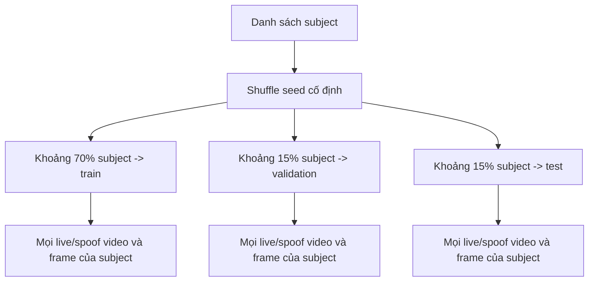

# Quy trình dữ liệu

## 1. Vấn đề của bộ 10.500 ảnh cũ

10.500 frame không đồng nghĩa 10.500 mẫu độc lập. Khi video 30 FPS được cắt liên tiếp, hai ảnh kề nhau gần như giống hệt. Nếu `train_test_split` chạy ở mức ảnh, model có thể thấy cùng người, cùng background, cùng thiết bị và cùng giây quay trong cả train/test. Accuracy khi đó chủ yếu đo khả năng nhớ session thay vì chống giả mạo ở tình huống mới.

Dataset/model cũ không có trong workspace nên chưa thể audit chính xác số người, số video hay mức rò rỉ. Không nên dùng lại số accuracy trước đây trong báo cáo nếu không tái tạo split.

## 2. Data contract bắt buộc

Mỗi video cần tối thiểu:

| Field | Ví dụ | Mục đích |
|---|---|---|
| `subject_id` | `S012` | Tách người giữa train/val/test |
| `session_id` | `indoor_day2` | Đo thay đổi thời gian/ánh sáng |
| `label` | `live` hoặc `spoof` | Ground truth chính |
| `attack_type` | `none`, `print`, `replay` | APCER theo loại tấn công |
| `source_video` | path tương đối | Gom frame về video-level |
| `device_id` | `webcam_a`, `phone_b` | Cross-device holdout |
| `dataset_name` | `internal`, `replay_attack` | Tách internal/external report |
| consent | mã biểu mẫu/phiên bản | Quản trị dữ liệu sinh trắc |

Script hiện suy ra các field chính từ path và để `device_id=unknown`; nhóm nên bổ sung device ID vào manifest sau khi trích xuất hoặc mở rộng parser từ metadata sidecar.

## 3. Cấu trúc đầu vào

```text
data/raw/
├── live/
│   └── <subject_id>/<session_id>/<video>.mp4
└── spoof/
    └── <attack_type>/<subject_id>/<session_id>/<video>.mp4
```

Ví dụ:

```text
data/raw/live/S001/indoor_day1/webcam_a.mp4
data/raw/live/S001/window_day2/webcam_a.mp4
data/raw/spoof/print/S001/indoor_day1/matte_a4.mp4
data/raw/spoof/print/S001/indoor_day1/glossy_bent.mp4
data/raw/spoof/replay/S001/dim_day2/phone_low_brightness.mp4
```

Lưu ý: `subject_id` của spoof là danh tính xuất hiện trên vật trình diện, không phải người đang cầm điện thoại/tờ giấy.

## 4. Ma trận thu thập khuyến nghị

Đây là kế hoạch tối thiểu có tính đồ án, không phải chuẩn chứng nhận:

| Trục | Khuyến nghị |
|---|---|
| Subject | Tối thiểu 20 nếu có thể; đa dạng giới, kính, tông da; consent rõ ràng |
| Live session | Ít nhất 3 phiên khác ngày/ánh sáng hoặc background |
| Capture camera | Webcam demo chính; thêm một webcam khác cho holdout/cross-device nếu mượn được |
| Print | Giấy thường/bóng, phẳng/cong, nhiều khoảng cách/góc, cắt viền và không cắt viền |
| Replay | Điện thoại/laptop, ảnh tĩnh/video, độ sáng màn hình thấp/cao, portrait/landscape |
| Lighting | Sáng trước mặt, sáng bên, phòng hơi tối nhưng vẫn qua quality gate |
| Motion | Đứng yên, quay đầu nhẹ, chớp mắt tự nhiên; tránh chỉ quay một kiểu |

Không nhân bản sample count bằng cách lưu mọi frame. Mặc định script lấy khoảng 3 FPS và bỏ frame liên tiếp có average hash gần trùng.

## 5. Chia dữ liệu



Quy tắc:

- Cùng subject chỉ thuộc một split.
- Cùng source video/session/device không được rải qua split.
- Validation dùng chọn epoch, weight và threshold.
- Test khóa lại và chỉ chạy khi pipeline đã chốt.
- Nếu dùng public dataset, không trộn frame ngẫu nhiên; giữ protocol chính thức hoặc dùng toàn bộ dataset đó như unseen domain.

Với dưới 3 subject, script từ chối tạo split vì không thể có ba tập tách người. Trên thực tế 3 subject chỉ đủ test code, không đủ đưa ra kết luận học thuật.

## 6. Lệnh chuẩn bị

```powershell
python scripts/prepare_dataset.py `
  --input data/raw `
  --output data/processed `
  --sample-fps 3 `
  --seed 42
```

Output:

```text
data/processed/
├── manifest.csv
├── train/live/*.jpg
├── train/spoof/*.jpg
├── val/live/*.jpg
├── val/spoof/*.jpg
├── test/live/*.jpg
└── test/spoof/*.jpg
```

## 7. Đánh giá ngoài dữ liệu tự thu

Để tránh kết luận chỉ dựa trên domain của nhóm, nên chọn ít nhất một bộ RGB công khai làm external test. Không gộp ngẫu nhiên ảnh công khai vào bộ tự thu; giữ protocol/partition chính thức hoặc dùng toàn bộ test partition như một unseen domain.

| Dataset | Quy mô/đặc điểm | Cách dùng phù hợp | Điều kiện truy cập |
|---|---|---|---|
| Replay-Attack | 1.300 video, 50 người, photo/video attack và nhiều ánh sáng | External test gần threat model print/replay, quy mô vừa | Theo điều khoản Idiap |
| OULU-NPU | 4.950 video, 6 mobile device, 3 session | Cross-device/session benchmark tốt | Ký EULA qua tổ chức |
| CelebA-Spoof | 625.537 ảnh, 10.177 subject, annotation phong phú | Pretraining/robustness cho texture; không thay video evaluation | Chỉ nghiên cứu phi thương mại |
| SiW-Mv2 | 14 spoof type, protocol known/unknown/cross-domain | Giai đoạn mở rộng unknown attack | License nghiên cứu từ MSU |

Nguồn và điều kiện:

- Replay-Attack catalog: <https://tsapps.nist.gov/BDbC/Search/Details/414>
- OULU-NPU: <https://sites.google.com/site/oulunpudatabase/welcome>
- CelebA-Spoof: <https://github.com/ZhangYuanhan-AI/CelebA-Spoof>
- SiW-Mv2: <https://cvlab.cse.msu.edu/siwm-v2-dataset.html>

Không tự động tải/redistribute các dataset này trong repository. Nhóm phải đọc, ký và tuân thủ license; manifest adapter cần lưu `dataset_name` và split gốc để kết quả có thể tái lập.

## 8. Data governance

- Consent phải nêu mục đích PAD, thời gian lưu, ai truy cập và cách rút consent.
- Dùng subject ID giả danh; không ghi họ tên vào path/manifest.
- Raw video và face crop không commit Git hoặc gửi lên dịch vụ công khai.
- Mã hóa ổ đĩa/thư mục chia sẻ nếu dữ liệu rời máy thu thập.
- Định lịch xóa và ghi lại dataset version/hash dùng cho báo cáo.
- Kiểm tra phân bố tông da, kính, giới/tuổi và điều kiện sáng ở từng split; không tuyên bố fairness khi chưa đo.

Không sửa `split` để làm kết quả đẹp hơn sau khi xem test.

## 9. Kiểm tra trước training

- [ ] Không có subject xuất hiện ở nhiều split.
- [ ] Mỗi split có cả live và spoof.
- [ ] Mỗi attack type mong muốn có video test.
- [ ] Không có ảnh hỏng/face crop rỗng.
- [ ] Kiểm tra thủ công ngẫu nhiên ít nhất 50 crop/split.
- [ ] Background/viền màn hình không vô tình là nhãn duy nhất model học.
- [ ] Thống kê theo số subject/video trước số frame.
- [ ] Lưu seed, commit, manifest hash.

## 10. Data card cần có trong báo cáo

Ghi rõ mục đích, số người, số phiên, số video, thiết bị, loại attack, điều kiện sáng, quy trình gán nhãn, consent, license, split, bias đã biết và chính sách xóa dữ liệu. Không commit ảnh/video khuôn mặt vào GitHub công khai nếu chưa có quyền phù hợp.
