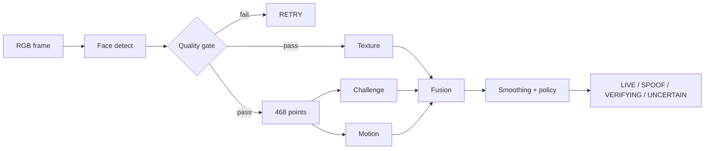

# Báo cáo đồ án — RGB Face Anti-Spoofing

## Tóm tắt

Đồ án nâng cấp hệ thống cảnh báo khuôn mặt thật/giả từ một CNN phân loại ảnh 32×32 thành pipeline PAD đa tín hiệu chạy trên webcam RGB phổ thông. Hệ thống kết hợp texture model nhẹ, 468 landmark, thử thách chớp mắt/quay đầu theo thứ tự ngẫu nhiên, chuyển động landmark theo thời gian, quality gate và cơ chế hợp nhất điểm bảo thủ. Song song, quy trình dữ liệu được thiết kế lại để tách train/validation/test theo người và video, đánh giá bằng APCER, BPCER, ACER ở mức video và lưu dấu vết tái lập bằng hash.

Repository chưa chứa bộ 10.500 ảnh/model cũ, nên báo cáo này mô tả thiết kế và trạng thái triển khai; mục kết quả thực nghiệm phải được cập nhật từ report do script sinh, không dùng số ước lượng.

## 1. Đặt vấn đề

Face recognition có thể bị đánh lừa bằng ảnh in hoặc video phát lại. Bài toán của hệ thống không phải xác định danh tính mà là PAD: đánh giá vật/thực thể đang xuất hiện trước camera có phải một trình diện sống hợp lệ hay một phương tiện giả mạo.

Phiên bản môn học trước có ưu điểm là đơn giản và chạy được, nhưng chưa đủ làm đồ án vì:

- Phân loại một frame, không có temporal evidence.
- Kích thước 32×32 quá nhỏ cho fine-grained spoof cue.
- Chia ảnh ngẫu nhiên sau khi cắt video có nguy cơ leakage rất cao.
- Không có metadata subject/session/device/attack.
- Chỉ dùng accuracy và một holdout ảnh, chưa có metric PAD/video-level.
- Script train, inference, data preparation trộn trách nhiệm và dùng đường dẫn hard-code.

## 2. Mục tiêu và câu hỏi nghiên cứu

### 2.1 Mục tiêu

1. Tái cấu trúc source code thành các thành phần độc lập, cấu hình được và kiểm thử được.
2. Xây pipeline đa tín hiệu không cần depth/IR/thermal sensor.
3. Ngăn data leakage và tạo protocol đánh giá tái lập.
4. Chạy được realtime trên laptop + webcam phổ thông.
5. Trả kết quả có vùng `VERIFYING/RETRY/UNCERTAIN`, không ép binary khi evidence yếu.

### 2.2 Câu hỏi nghiên cứu

- RQ1: MobileNetV3 texture có tổng quát sang subject/session chưa thấy tốt hơn CNN 32×32 cũ không?
- RQ2: Challenge-response ngẫu nhiên giảm print/replay APCER bao nhiêu?
- RQ3: Landmark motion có bổ sung giá trị sau texture + challenge không?
- RQ4: Fusion đa tín hiệu ảnh hưởng thế nào tới security (APCER), usability (BPCER/challenge success) và latency?

## 3. Phạm vi

### Trong phạm vi

- Webcam RGB 640×480 hoặc tương đương.
- Live face, print attack, replay ảnh/video qua màn hình.
- Một khuôn mặt tại một thời điểm.
- Inference local, CPU-friendly.

### Ngoài phạm vi

- Nhận diện danh tính.
- 3D mask cao cấp và sensor chuyên dụng.
- Virtual camera/video injection/malware trước tầng capture.
- Chứng nhận bảo mật theo ISO; project chỉ dùng thuật ngữ/metric reporting phù hợp.

## 4. Nghiên cứu liên quan và lựa chọn kỹ thuật

Các hướng chính gồm texture/image quality, motion/challenge-response, physiological cue như rPPG, auxiliary depth supervision và sensor depth/IR/thermal. CDCN cho thấy gradient/fine detail quan trọng; các công trình domain generalization nhấn mạnh chênh lệch camera, blur và resolution; challenge-response thêm temporal interaction nhưng không đủ nếu dùng riêng.

Bản triển khai chọn MobileNetV3-Small vì cân bằng giữa transfer learning, tốc độ CPU và export ONNX; MediaPipe cung cấp landmark ổn định để tạo challenge; motion residual chỉ mang trọng số phụ. rPPG bị hoãn do điều kiện webcam/ánh sáng không ổn định, còn depth/thermal bị loại do trái ràng buộc chi phí.

Phân tích và nguồn đầy đủ: [METHOD_SELECTION.md](METHOD_SELECTION.md).

## 5. Phân tích yêu cầu

### 5.1 Yêu cầu chức năng

- Nhận video webcam và phát hiện đúng một khuôn mặt.
- Kiểm tra brightness, blur và face size.
- Chạy texture inference từ ONNX.
- Sinh thử thách ngẫu nhiên gồm blink/turn left/turn right.
- Theo dõi trạng thái challenge qua nhiều frame.
- Tính temporal landmark motion.
- Hợp nhất score/reliability và trả verdict có reason.
- Chuẩn bị dataset từ video, giữ metadata và split theo subject.
- Train/export model, chọn threshold validation, đánh giá test.

### 5.2 Yêu cầu phi chức năng

- Không cần phần cứng ngoài webcam RGB.
- Fail closed khi thiếu model/evidence.
- Có cấu hình tập trung, unit test và hướng dẫn tái lập.
- Không commit biometric data/model artifact mặc định.
- Có latency report và degradation mode rõ ràng.

## 6. Kiến trúc hệ thống



Tài liệu chi tiết và sequence/state diagram: [../ARCHITECTURE.md](../ARCHITECTURE.md).

## 7. Thiết kế thuật toán

### 7.1 Quality gate

- Brightness: mean grayscale trong face crop.
- Blur: variance of Laplacian.
- Face scale: bounding-box area / frame area.
- Nếu fail, trả `RETRY` và lý do cụ thể.

### 7.2 Texture branch

- Backbone MobileNetV3-Small pretrained.
- Input 224×224 RGB, ImageNet normalization.
- Output 2 logits theo `[spoof, live]`.
- Weighted cross entropy xử lý lệch lớp.
- Augmentation gồm crop, flip, color jitter và blur nhẹ.
- Early stopping theo validation ACER; export ONNX opset 17.

### 7.3 Landmark challenge

- EAR hai mắt phát hiện chuỗi open → closed → reopen.
- Yaw proxy tính từ nose/eye/face-width và so với neutral baseline của phiên.
- Random sampling không lặp từ blink/left/right.
- Mỗi action yêu cầu nhiều frame liên tiếp để giảm noise.
- Timeout trả `FAILED`, policy chuyển thành `RETRY`.

### 7.4 Temporal motion

Chọn các landmark đại diện, căn chỉnh shape hiện tại với shape đầu bằng similarity transform (dịch/chuyển, scale, rotation), rồi tính RMS residual. Residual phản ánh phần biến dạng còn lại; score/reliability chỉ ổn định sau đủ frame. Đây là weak cue cần ablation.

### 7.5 Fusion

```text
effective_weight_i = weight_i × reliability_i
live_score = Σ(effective_weight_i × signal_i) / Σ(effective_weight_i)
```

Policy kiểm tra quality, hard texture reject, challenge, evidence coverage, số frame ổn định và threshold. Missing signal không được thay bằng 0; vùng giữa threshold trả `UNCERTAIN`.

## 8. Dữ liệu

Protocol mới coi subject và source video là group, không coi frame là sample độc lập. Cấu trúc path lưu class/attack/subject/session; manifest lưu frame index, timestamp, split và device placeholder. Script mặc định sample 3 FPS và loại frame liên tiếp gần trùng.

Kế hoạch thu thập, data card, consent và checklist: [DATASET_PROTOCOL.md](DATASET_PROTOCOL.md).

## 9. Huấn luyện và tái lập

```text
video -> crop/dedup -> manifest -> subject split
-> train -> validation ACER early stop -> ONNX
-> validation threshold -> locked test -> hash report
```

Seed mặc định là 42. Report evaluation chứa SHA-256 của manifest và model. Checkpoint `.pt`, model `.onnx`, raw video và crop đều bị Git ignore.

## 10. Đánh giá

Metric chính là video-level APCER, BPCER và ACER; metric phụ gồm ROC-AUC, EER, F1, frame metrics và latency. Protocol gồm subject-disjoint, session/device holdout, attack holdout, end-to-end webcam và ablation các nhánh.

Chi tiết: [EVALUATION.md](EVALUATION.md).

### 10.1 Kết quả hiện tại

| Hạng mục | Trạng thái | Ghi chú |
|---|---|---|
| Unit test logic | 33/33 pass | Bundled Python 3.12.14, ngày 11/09/2026 |
| Dataset audit | Chưa chạy | Dataset 10.500 ảnh không có trong repo |
| Texture training | Chưa chạy | Chưa có manifest/model artifact |
| Frame/video metrics | Chưa có | Không dùng số minh họa |
| End-to-end webcam | Chưa chạy trên máy người dùng | Cần cài dependency/model/camera |
| Ablation | Chưa chạy | Thực hiện sau khi khóa test set |

### 10.2 Cách cập nhật kết quả

Chạy `scripts/evaluate_texture.py`, link report sinh ra vào đây, sau đó bổ sung bảng ablation/manual evidence. Không copy accuracy cũ nếu split cũ không chứng minh được subject/video isolation.

## 11. Kiểm thử

Unit test bao phủ:

- Blink open-close-reopen và turn relative baseline.
- Timeout/challenge sequence.
- Fusion yêu cầu challenge và evidence coverage.
- Hard spoof texture và quality retry.
- APCER/BPCER/ACER/AUC/video aggregation.
- Subject split/leakage audit.
- Procrustes invariance với translation/rotation/scale.

Manual test bao phủ quality, nhiều mặt, người thật, print và replay. Xem [../eval/manual_challenge_cases.csv](../eval/manual_challenge_cases.csv).

## 12. Rủi ro và đạo đức

- Bias theo tông da, kính, tuổi và điều kiện sáng nếu data không cân bằng.
- False accept là rủi ro an ninh; false reject gây ảnh hưởng người dùng thật.
- Dữ liệu khuôn mặt cần consent, access control, retention/deletion policy.
- Challenge gây vấn đề accessibility cho người khó chớp mắt/quay đầu; phải có phương án xác minh thay thế.
- Kết quả PAD không chứng minh identity và không nên dùng một mình cho quyết định hậu quả cao.

## 13. Giới hạn

- Chưa có kết quả thực nghiệm trong workspace.
- Challenge có thể bị adaptive replay/deepfake vượt qua.
- Texture model có domain shift.
- Motion cue là heuristic.
- Caffe face detector cũ có thể giới hạn góc mặt/ánh sáng.
- Không có protection cho virtual-camera injection.

## 14. Kế hoạch tiếp theo

1. Khôi phục video gốc/metadata và tạo manifest mới.
2. Chạy data audit; thu bổ sung subject/session/device còn thiếu.
3. Train MobileNetV3 baseline và LBP baseline.
4. Tune threshold trên validation, khóa test.
5. Chạy P1–P4 và ablation; điền actual results.
6. Phân tích false accept/false reject và hiệu chỉnh quality/challenge.
7. Nếu còn compute, so sánh CDCN hoặc auxiliary depth; rPPG chỉ là research branch.
8. Quay demo có cả success, retry và attack cases.

## 15. Tài liệu tham khảo

1. ISO/IEC 30107-3:2023, *Biometric presentation attack detection — Part 3: Testing and reporting*. <https://www.iso.org/standard/79520.html>
2. Yu et al., *Searching Central Difference Convolutional Networks for Face Anti-Spoofing*, CVPR 2020. <https://openaccess.thecvf.com/content_CVPR_2020/html/Yu_Searching_Central_Difference_Convolutional_Networks_for_Face_Anti-Spoofing_CVPR_2020_paper.html>
3. Liu et al., *Learning Deep Models for Face Anti-Spoofing: Binary or Auxiliary Supervision*, CVPR 2018. <https://openaccess.thecvf.com/content_cvpr_2018/CameraReady/0615.pdf>
4. Sun et al., *Rethinking Domain Generalization for Face Anti-Spoofing*, CVPR 2023. <https://openaccess.thecvf.com/content/CVPR2023/html/Sun_Rethinking_Domain_Generalization_for_Face_Anti-Spoofing_Separability_and_Alignment_CVPR_2023_paper.html>
5. Google AI Edge, *MediaPipe Face Landmarker*. <https://ai.google.dev/edge/api/mediapipe/python/mp/tasks/vision/FaceLandmarkerOptions>
